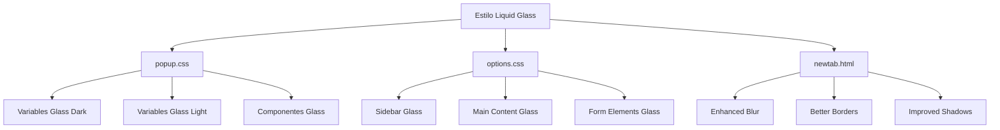

# Plan de Implementación - Estilo Liquid Glass

## Resumen
Implementar el estilo "liquid glass" (vidrio líquido) en toda la extensión: popup, options y newtab, soportando tanto modo claro como oscuro.

## Características del Estilo Liquid Glass

### Elementos Clave
1. **Backdrop blur** - Efecto de vidrio translúcido
2. **Bordes brillantes** - Bordes sutiles con gradientes o brillos
3. **Sombras suaves** - Sombras difuminadas para profundidad
4. **Fondos con opacidad** - Capas semitransparentes
5. **Efectos de relieve** - Brillos y degradados sutiles
6. **Animaciones fluidas** - Transiciones suaves

---

## Implementación por Archivo

### 1. popup.css - Estilos Liquid Glass

#### Variables CSS (modo oscuro)
```css
:root {
  /* Fondo con blobs animados */
  --bg: #0a0a14;
  --bg-glass: rgba(18, 18, 32, 0.75);
  --glass-border: rgba(255, 255, 255, 0.08);
  --glass-border-accent: rgba(79, 124, 255, 0.3);
  --glass-blur: 16px;
  --glass-shadow: 0 8px 32px rgba(0, 0, 0, 0.4);
  --glass-shadow-hover: 0 12px 40px rgba(79, 124, 255, 0.15);
}
```

#### Elementos a actualizar:
- `.popup-wrap` - Contenedor principal con glass
- `.header` - Header con blur y borde brillante
- `.rate-card` - Tarjetas con efecto glass y hover
- `.ticker-section` - Ticker con glass
- `.footer` - Footer con glass sutil

#### Modo claro
- Fondo más claro con blur
- Bordes con más brillo
- Sombras más suaves

---

### 2. options.css - Estilos Liquid Glass

#### Cambios principales:
- Sidebar con efecto glass
- Secciones principales con glass
- Tarjetas de opciones con glass
- Botones con efectos de relieve
- Inputs con bordes brillantes

#### Elementos a actualizar:
- `.sidebar` - Sidebar con glass
- `.main` - Área principal
- `.section-header` - Headers de secciones
- `.field-group` - Grupos de campos
- `.toggles` - Interruptores con estilo glass
- `.btn-primary`, `.btn-secondary` - Botones mejorados

---

### 3. newtab.html - Mejorar Glassmorphism existente

El newtab ya tiene una base de glassmorphism. Se mejorará:
- Aumentar intensidad del blur
- Agregar más bordes brillantes
- Mejorar efectos de hover
- Añadir más profundidad a los paneles
- Optimizar blobs animados

---

## Diagrama de Estructura



---

## Orden de Implementación

1. **popup.css** - Actualizar primero (más pequeño)
2. **options.css** - Segundo (más complejo)
3. **newtab.html** - Tercero (ya tiene base)
4. **Verificación** - Probar ambos modos

---

## Nota sobre Compatibilidad

- Usar `-webkit-backdrop-filter` para Safari
- Proporcionar fallbacks para navegadores sin soporte
- Mantener animaciones suaves (60fps)
